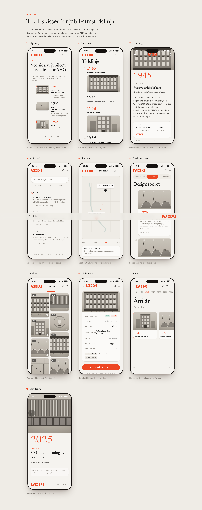

# Ved sida av jubileet — ei tidslinje for AHO

Ein scrollbar tidslinje-app som dokumenterer historia til **Arkitektur- og
designhøgskolen i Oslo (AHO)**, som fyller **80 år i 2025**. Frå krisekurset
ved Kunstindustriskulen i 1945 til skulen ved Akerselva i dag.

iOS-/iPhone-først nettstad bygd med **Next.js 15 + React 19 + Tailwind v4**.
Auto-deploy til **aho-80.iverfinne.no** / **aho-80.vercel.app** via Vercel.

> **Ingen Google-AI-integrasjon.** Appen byggjer og køyrer heilt utan
> API-nøklar — arkivsøket gjer eit lokalt oppslag i dei verifiserte
> hendingane. (Den tidlegare Gemini-integrasjonen er teken ut med vilje.)

## Ti UI-skisser

Den eksplisitte leveransen: **ti genererte UI-skisser** for appen, bygde som
ekte React-skjermar (ikkje AI-bilete) og synlege på **`/skisser`**. Rendra
PNG-ar ligg i [`design/sketches/`](design/sketches/).

| # | Skjerm | Innhald |
|---|--------|---------|
| 01 | Opning | Hero med «80 ÅR», serif-tittel og tidslinje-nodar |
| 02 | Tidslinje | Vertikal liste med år, foto og nodar |
| 03 | Hending | Detaljside for 1945 med full-bleed arkivfoto |
| 04 | Arkivsøk | Søk i kjeldene med filter og kjeldetaggar |
| 05 | Stadene | Kart frå St. Olavs gate til Maridalsveien |
| 06 | Designsporet | Fagfilter: arkitektur · design · landskap |
| 07 | Arkiv | Fotogalleri i rutenett, filtrert på tiår |
| 08 | Kjeldekort | Kjeldekritikk: rettsstatus, lisens, tilgang |
| 09 | Tiår | Horisontal tiår-navigasjon og filmstrip |
| 10 | Jubileum | Avslutning: 2025, 80 år, kolofon |



## Køyr lokalt

```bash
npm install
npm run dev      # http://localhost:3000
npm run build    # produksjonsbygg
```

## Struktur

```
app/
  page.tsx            # heim: hero + tidslinje + arkivsøk
  skisser/page.tsx    # galleri med dei ti UI-skissene
  api/search/route.ts # lokalt arkivsøk (ingen eksterne kall)
components/
  Timeline.tsx        # vertikal tidslinje (heim)
  sketches.tsx        # dei ti skjermane
  ArchivePhoto.tsx    # rettsfrie svart-kvitt «arkivfoto» (SVG)
  ArkivSok.tsx, ui.tsx
lib/
  timeline.ts         # verifiserte hendingar 1945–2025 + kjelder
  aho-bilete.ts       # typar for Notion-databasen (rettar)
  notion.ts           # valfri Notion-adapter (env-gated)
public/logo/          # offisielle AHO-logoar + utkappa AHO-merke
design/sketches/      # rendra PNG-ar av skissene
scripts/shoot.mjs     # render skjermbilete med Playwright
docs/DATA.md          # datamodell, kjelder og rettar
```

## Data og kjelder

Tidslinja byggjer på kryssjekka årstal frå Store norske leksikon, Wikipedia og
AHO si eiga historieside. Bileta i appen er **rettsfrie SVG-illustrasjonar** —
faktiske arkivfoto kjem inn via Notion-databasen `aho_bilete` når rettane er
avklara. Sjå [`docs/DATA.md`](docs/DATA.md).
